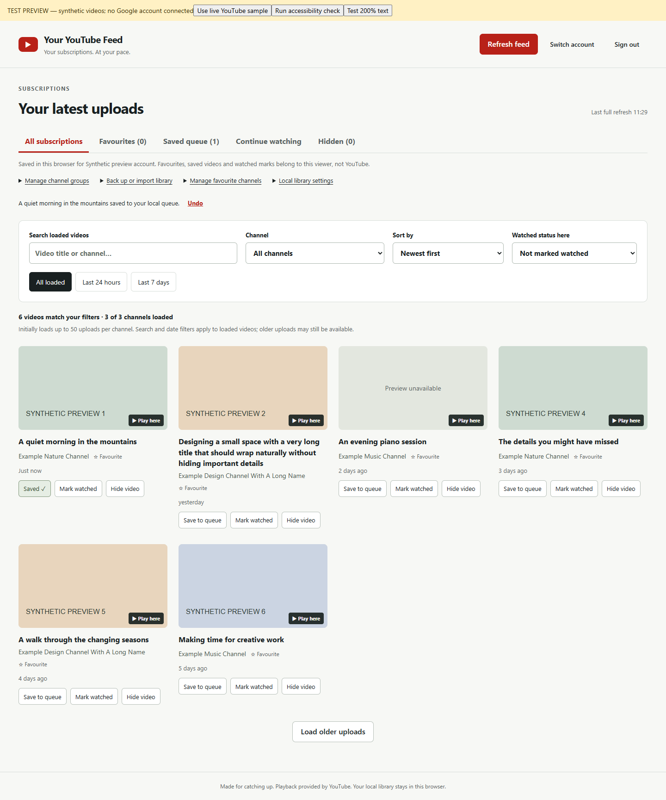

# YouTube Subscriptions Dashboard

**Your subscriptions. At your pace.** A local YouTube subscription manager with a chronological feed, channel groups, a saved queue and playback progress stored in your browser.

Browse the channels you chose, search loaded uploads, and decide what to watch next. Built with React and the YouTube Data API. Independent project; not affiliated with or endorsed by Google or YouTube.



*Demo screenshot: invented account and channel data; no personal subscriptions.*

## What you can do

- Browse subscribed channels in newest-first or oldest-first order.
- Search loaded videos and filter by channel, date, group and local watched status.
- Favourite channels, create channel groups, save a queue and hide unwanted videos.
- Play videos in an embedded YouTube player and resume locally saved playback positions.
- Export and import your local library, with validation and a preview before merging.
- Use read-only YouTube access: local actions do not change your YouTube subscriptions or playlists.

**Requires your own Google OAuth client for real subscriptions.** No shared credentials are included. Try the synthetic demo first if you just want to explore the interface.

## Try the demo without a Google account

Install Node.js 24 and npm, then:

```sh
git clone https://github.com/RicV-Sam/youtube-subscriptions-dashboard.git
cd youtube-subscriptions-dashboard
npm ci
npm run demo
```

Open http://localhost:3001 and click **Sign in with Google**. In this labelled demo, that button uses a fake account and synthetic videos; it does not open Google sign-in. One channel intentionally fails once so you can try **Retry**. Stop the server with Ctrl+C.

The optional live-sample button and video playback contact YouTube. For screenshots or filming without external playback, keep the default synthetic data and do not open a player. Use a fresh browser profile and never import a personal library into the demo.

## Connect your subscriptions

1. Follow the [Google setup guide](docs/google-setup.md) to create your own OAuth client.
2. Copy `.env.example` to `.env` in this folder and enter your client ID. Never add a client secret.
3. Run `npm start`, open http://localhost:3000 and choose **Sign in with Google**.
4. Allow read-only YouTube access. Your subscriptions load progressively.

On Windows, you can also double-click `start-dashboard.bat`. Its managed server stops shortly after you close the final dashboard tab. The batch launcher is Windows-specific; `npm start` is the manual alternative. Stop a manually started server with Ctrl+C.

Use the same browser and origin to retain your local library. Stop the original dashboard before launching another copy on port 3000.

## Privacy and limits

- Access tokens and fetched video metadata are held in tab memory. Tokens are not written to localStorage.
- Video/channel IDs, groups, timestamps and playback positions persist in browser localStorage, separated by YouTube channel ID. This is not encrypted storage or a separate browser security boundary.
- Sign-out clears the active session, but does not erase the saved library or revoke Google access. Use the library settings to clear saved choices.
- Real sign-in, API requests, thumbnails and playback contact Google/YouTube. This is not an offline or anonymous YouTube client.
- Search covers loaded uploads, not the whole YouTube catalogue. Older uploads require **Load older uploads**.
- Watched marks are manual and do not sync with YouTube watch history. Embedded playback remains subject to YouTube behaviour and restrictions; this project is not an ad blocker or downloader.
- API quotas, permissions, unavailable videos and embedding restrictions can limit results.

Read the [privacy details](docs/privacy.md), [full behaviour guide](docs/usage.md) and [troubleshooting guide](docs/google-setup.md#troubleshooting).

## Development

```sh
npm ci
npm run check:privacy
npm test
npm run test:launcher
npm run test:tooling
npm run build
```

The GitHub workflow runs privacy checks, tests and a build on Windows and Linux with Node.js 24. See the [GitHub Actions results](https://github.com/RicV-Sam/youtube-subscriptions-dashboard/actions) for the published revisions. Mocked tests cannot verify your Google project's consent settings or real account access.

The toolchain uses Vite for development/builds, Vitest for browser tests and ESLint for source checks. Review [maintenance notes](docs/maintenance.md) before planning a hosted deployment. This repository is intended for local use; `npm start` is a development server.

## Contributing and support

Bug reports, focused improvements and documentation fixes are welcome. Start with [CONTRIBUTING.md](CONTRIBUTING.md) and the [code of conduct](CODE_OF_CONDUCT.md). Use GitHub Issues for non-sensitive questions and bugs. Do not attach account screenshots, library exports, tokens or `.env` files.

For vulnerabilities, follow [SECURITY.md](SECURITY.md). Maintained by [RicV-Sam](https://github.com/RicV-Sam); no response-time or long-term support guarantee is offered.

## Licence

[MIT](LICENSE). Copyright 2026 RicV-Sam. Dependencies retain their own licences. The licence does not grant rights to YouTube videos, artwork or trademarks.
